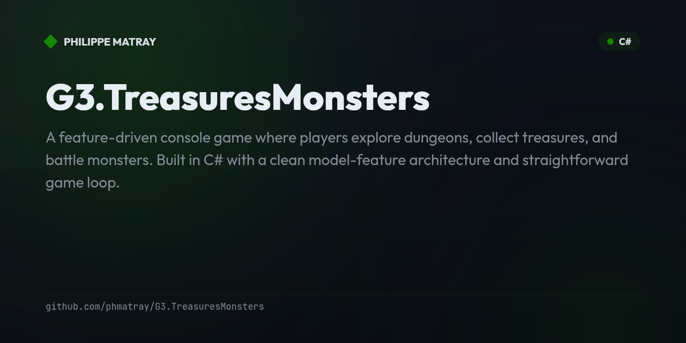

# G3.TreasuresMonsters — Console Treasures & Monsters game

<!-- portfolio-badges:start -->
<!-- Identity -->
[](https://github.com/phmatray/G3.TreasuresMonsters)

[](https://github.com/phmatray/G3.TreasuresMonsters/stargazers)
[](https://github.com/phmatray/G3.TreasuresMonsters/network/members)
[](https://github.com/phmatray/G3.TreasuresMonsters/blob/HEAD/LICENSE)

<!-- Activity -->
[](https://github.com/phmatray/G3.TreasuresMonsters/issues)
[](https://github.com/phmatray/G3.TreasuresMonsters/pulls)
[](https://github.com/phmatray/G3.TreasuresMonsters/commits)
<!-- portfolio-badges:end -->

<!-- portfolio-toc:start -->

## Table of Contents

- [✨ Features](#-features)
- [📦 Installation](#-installation)
- [🚀 Quick Start](#-quick-start)
- [Tech Stack](#tech-stack)
- [📄 License](#-license)
- [Contributing](#contributing)

<!-- portfolio-toc:end -->


A feature-driven console game where players explore dungeons, collect treasures, and battle monsters. Built in C# with a clean model-feature architecture and straightforward game loop.

## ✨ Features
- Turn-based dungeon exploration
- Treasure collection and monster combat
- Feature-driven architecture for game mechanics
- Console-based rendering with ASCII graphics
- Configurable difficulty and level generation

## 📦 Installation
```bash
git clone https://github.com/phmatray/G3.TreasuresMonsters
cd G3.TreasuresMonsters
dotnet run --project G3.TreasuresMonsters
```

## 🚀 Quick Start
```bash
dotnet run --project G3.TreasuresMonsters
# Use arrow keys to move, collect T (treasures), avoid M (monsters)
```

<!-- portfolio-techstack:start -->

## Tech Stack

- **.NET 10**
- xunit.v3
- xunit.runner.visualstudio
- Microsoft.Extensions.DependencyInjection

<!-- portfolio-techstack:end -->

<!-- portfolio-roadmap:start -->

## Roadmap

Planned work and known limitations are tracked in the [open issues](https://github.com/phmatray/G3.TreasuresMonsters/issues). Contributions toward them are welcome.

<!-- portfolio-roadmap:end -->

## 📄 License
MIT — see LICENSE

---

<!-- portfolio-sections:start -->

## Contributing

Contributions are welcome. Open an issue first to discuss any significant change.

1. Fork the repository and create your branch (`git checkout -b feat/my-feature`)
2. Commit your changes (`git commit -m 'feat: ...'`)
3. Push the branch and open a Pull Request

<!-- portfolio-sections:end -->
